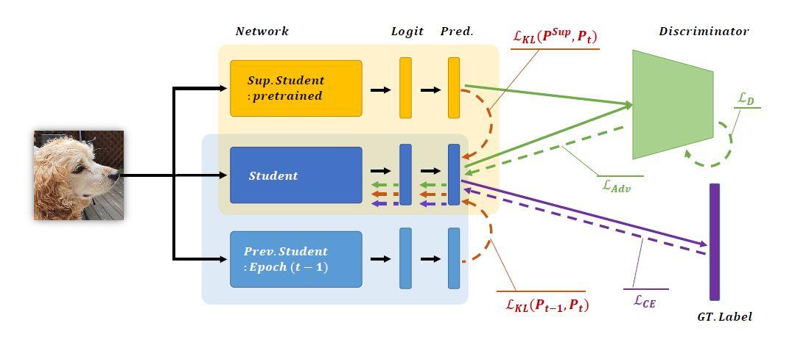

# AI-KD

Official PyTorch implementation of Knowledge-Based Systems (KBS) paper

[**AI-KD: Adversarial learning and Implicit regularization for self-Knowledge Distillation**](https://doi.org/10.1016/j.knosys.2024.111692).

## Requirements
- Python3
- PyTorch (> 1.7)
- NumPy
- tqdm

## Acknowledgements
Our code is modified and adapted on these great repositories:

- [Self-Knowledge Distillation with Progressive Refinement of Targets](https://github.com/lgcnsai/PS-KD-Pytorch)
- [Feature-map-level Online Adversarial Knowledge Distillation](https://dl.acm.org/doi/10.5555/3524938.3525125)


## Citation
If you use this method or this code in your research, please cite as:
```
@article{kim2024ai,
  title={AI-KD: Adversarial learning and Implicit regularization for self-Knowledge Distillation},
  author={Kim, Hyungmin and Suh, Sungho and Baek, Sunghyun and Kim, Daehwan and Jeong, Daun and Cho, Hansang and Kim, Junmo},
  journal={Knowledge-Based Systems},
  volume={293},
  pages={111692},
  year={2024},
  publisher={Elsevier}
}
